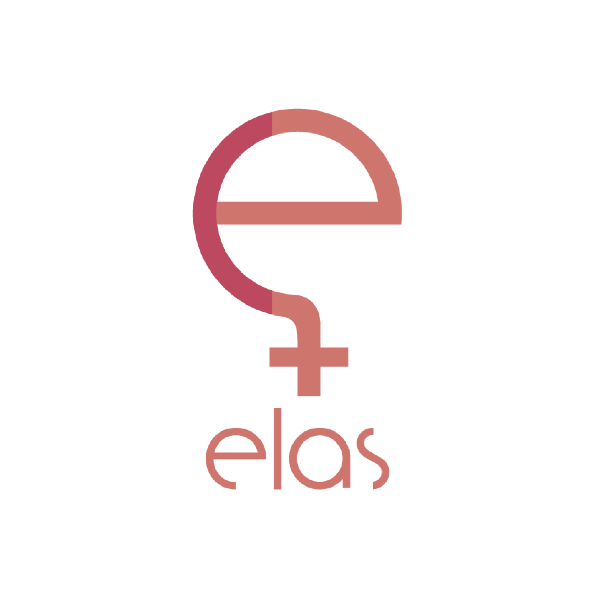

# Site dElas  

## Índice
- [Descrição do projeto](#pencil-Descrição-do-projeto)
- [Esboço do Layout do site](#pencil-Esboço-do-Layout-do-site)
- [O que eu ganho participando do projeto?](#thought_balloon-O-que-eu-ganho-participando-do-projeto)
- [Quais tecnologias e ferramentas devem ser usadas?](#computer-Quais-tecnologias-e-ferramentas-devem-ser-usadas)
- [Links úteis](#link-Links-úteis)
- [Qual perfil do aprendiz se espera?](#woman-Qual-perfil-do-aprendiz-se-espera)
- [Cronograma sugerido](calendar-Cronograma-sugerido)
- [Mentora](#woman_teacher-Mentora)
- [Contatos](#loudspeaker-Contatos)
- [Sobre a organização](#clipboard-Sobre-a-organização)
- [Contatos Elas](#telephone-Contatos-Elas)

## :pencil: Descrição do projeto 

A ideia principal do projeto é desenvolver um site para centralizar as informações e produções internas da organização. Sendo assim, servirá como ambiente para divulgação das ações, materiais e integrantes, tornando a comunidade mais ativa.

#### :pencil2: [Esboço do Layout do Site](https://github.com/elasComputacao/Site/blob/master/assets/layout.png?raw=true)

## :thought_balloon: O que eu ganho participando do projeto?

A principal conquista adquirida nesse projeto é relacionada ao estímulo à melhoria no desenvolvido em habilidades interpessoais como: trabalho em equipe, organização, comunicação, experiência em open source e criatividade. Além de que, terá conhecimento direto sobre a motivação inerente a organização e desenvolverá habilidades técnicas em desenvolvimento web, especificamente na área de front-end.

## :computer: Quais tecnologias e ferramentas devem ser usadas?

- [HTML5](https://developer.mozilla.org/pt-BR/docs/Web/HTML)

- [CSS 3](https://developer.mozilla.org/pt-BR/docs/Web/CSS)

- [JavaScript](https://www.javascript.com/)

- [VSCode](https://code.visualstudio.com/)

## :link: Links úteis

- [Site: Mulheres na computação](https://mulheresnacomputacao.com/)

- [Site: Rails Girls](http://railsgirls.com/)

- [Site: OpenDevUFCG](https://opendevufcg.org/)

- [MDN web docs](https://developer.mozilla.org/pt-BR/)

- [FrontMasters](https://frontendmasters.com/books/front-end-handbook/2019/#4.28)

## :woman: Qual perfil da aprendiz se espera?

O perfil da aprendiz se baseia em ser proativa, ser aberta a novas aprendizados e que queira contribuir com a expansão da nossa causa. Além de que, o foco principal é para pessoas que são iniciantes no estudo de tecnologias para desenvolvimento web.

## :calendar: Cronograma sugerido

#### 1ª fase de desenvolvimento

- [ ] Apresentação das tecnologias que serão utilizadas e a discussão do projeto para o aprendiz.
    
- [ ] Formação do layout do site.
    
- [ ] Implementação do esqueleto das páginas.

- [ ] Estrutural / Princípio da estilização
    
#### 2ª fase de desenvolvimento

- [ ] Implementar design e parte lógica das páginas
    
- [ ] Continuação da estilização
    
- [ ] Parte lógica das páginas
    
- [ ] Implementação

- [ ] Continuação da parte lógica das páginas
    
- [ ] Implementação
    
#### 3ª fase de desenvolvimento

- [ ] Criação do conteúdo das páginas
    
- [ ] Sobre, contato, participantes, eventos acontecidos/acontecerão e agenda
    
- [ ] Continuação da criação de conteúdo das páginas
    
- [ ] Textos (estrutura)
    
- [ ] Deploy
    
- [ ] Hospedagem do site
    
#### :pushpin: Adicional

- [ ] Abertas para decisões futuras e será decidido na primeira semana do evento.
    
## :woman_teacher: Mentora

Leandra Oliveira, é estudante de Ciência da Computação, membra, atual coordenadora e fascinada pelo propósito do Elas, apaixonada por desenvolvimento web, entusiasta  Teoria dos Grafos e também interessada pela área de análise de dados. Diante da proposta do AndromeDev, viu uma chance de compartilhar os seus conhecimentos na área e de aprender ainda mais com a troca de experiências com as futuras aprendizes.

### :loudspeaker: Contatos:

-  [Linkedin](https://www.linkedin.com/in/leandra-silva-831b891ab/)
    
-  [GitHub](https://github.com/LeandraOliveiraS)
    
-  [Instagram](https://www.instagram.com/_leandra.oliveiras/)
    
-  Discord: Leandra#1156
    
-  Email: leandra.silva@ccc.ufcg.edu.br
    
## :clipboard: Sobre a organização:

O Elas@computação surge com o objetivo de reunir mulheres do curso de Ciência da Computação da Universidade Federal de Campina Grande e também outras mais. Nosso foco é levantar, discutir e impulsionar os assuntos que dizem respeito ao feminino, feminismo, nossos espaços, falas, movimentos e necessidades. A nossa missão é inspirar mulheres mostrando que todas são capazes de trabalhar e serem as melhores profissionais na área que Elas quiserem. Somos uma comunidade que se apoia e que está disposta sempre a acolher novas membras e continuamente ajudá-las a se desenvolverem como mulheres e profissionais.
 
##  :telephone: Contatos Elas:

-   [GitHub](https://github.com/elasComputacao)
    
-   [Instagram](https://instagram.com/elascomputacao?igshid=1om5sr73g0tmu)
    
-   [Facebook](https://www.facebook.com/elascomputacao)
    
-   Email: elas@computacao.ufcg.edu.br
